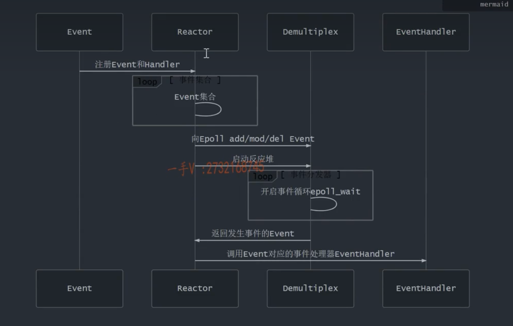

# simpleMuduo

A simplified Muduo network lib using C++ 11 features.

* [X] 用C++ 11重写陈硕的muduo网络库，去掉对Boost库的依赖
* [X] EchoServer实现、运行
* [ ] HTTP Server实现、运行

# simpleMuduo网络库的运行原理

* [ ] 如何理解Reactor网络模型？
* [ ] 各个模块都是干嘛的？
* [ ] 一个客户连接来了后会发生什么？
* [ ] 为啥muduo网络库不使用ET模式？出于什么考量？😧

# 模块简要介绍

按如下顺序去梳理的话会比较合适

* [X] noncopyable
* [X] Logger
* [X] Timestamp
* [X] InetAddress
* [X] Channel
* [X] Poller
* [X] EpollPoller
* [ ] 获取线程tid
* [ ] EventLoop
* [ ] Thread
* [ ] EventLoopThread
* [ ] Socket
* [ ] Acceptor
* [ ] TcpServer

## noncopyable

noncopyable被继承以后，派生类对象可以正常的构造和析构，但是派生类对象无法进行拷贝构造和赋值操作

这是通过 `= delete` 实现的

有点像单例模式？感觉就是啊

## Logger

muduo网络库里的日志系统并不是很优秀

采用的是同步的日志系统，可能会存在性能瓶颈

当然，合理使用调试和日志输出即可，影响不会太大

定义了几个宏来写不同级别的日志：

* LOG_INFO
* LOG_ERROR
* LOG_FATAL
* LOG_DEBUG

## InetAddress

封装了IPv4 socket地址，这个暂时没有太多值得说道的

## Channel

看到Channel就要开始大致理顺一下这个网络库的抽象层次结构了

它大概是这样的：

* TCPServer
  * EventLoop
    * Poller抽象类(用于封装select, poll, epoll)
      * PollPoller
      * EPollPoller(目前只实现了这个)
      * ChannelMap(管理当前Loop关心的那些Channel对象)
        * `Channelmap<fd, Channel*>`
        * ChannelMap记录着sockfd及其对应的Channel对象
    * ChannelList activechannel_
      * 保存活跃的channels，交给事件处理程序
      * 每次处理完毕activechannel_都要他都要clear一下
  * EventLoop
  * ...
  * EventLoop
  * 即One Thread Per Loop

可以看到，Channel类是核心的抽象数据结构，所以应该先搞懂它的内部设计再看外部使用它的那些类

## Poller抽象类

它是抽象类，用来规范派生类EPollPoller, PollPoller的行为

⚠️注意：目前我只实现了EPollPoller

## EPollPoller

封装系统调用epoll_create成EPollPoller方法

封装系统调用epoll_ctl进行add/mod/del，对应updateChannel/removeChannel...方法

封装epoll_wait成poll方法

通过以上封装就很好理解EPollPoller干的事情了，监听sockfd上的事件然后更新相应的数据结构，交给时间处理函数EventHandler

## 获取线程tid

如何获取当前线程的tid?

请注意：是获取“线程tid"不是进程“pid"

`ps -ef | grep mysqld`获取的是pid

## EventLoop

# 多Reactor 多线程

这里有一个问题后续再明确一下，就是SubReactor是否会将业务处理交给WorkThread

这个[项目](https://github.com/Shangyizhou/A-Tiny-Network-Library)里的示意图是有画的是有工作线程池的

下面这个图存一个档，我觉得画的不太贴合muduo网络库，但是抽象层面似乎挺有逻辑，看看能不能改进一下，结合muduo网络库具体的类再重制一下这个结构图

