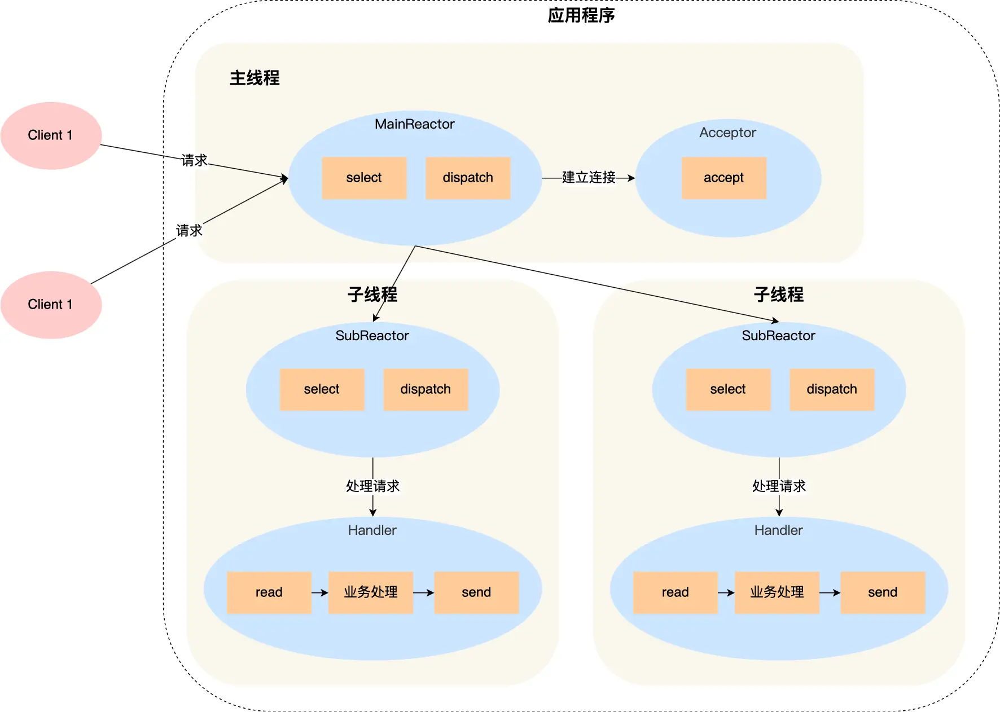

# simpleMuduo

A simplified Muduo network lib using C++ 11 features.

* [X] 用C++ 11重写陈硕的muduo网络库，去掉对Boost库的依赖
* [X] EchoServer实现、运行
* [ ] HTTP Server实现、运行

# simpleMuduo网络库的运行原理

* [ ] 如何理解Reactor网络模型？
* [ ] 各个模块都是干嘛的？
* [ ] 一个客户连接来了后会发生什么？

# 模块解析

* [X] noncopyable
* [X] Logger
* [X] Timestamp
* [ ] InetAddress
* [ ] Channel
* [ ] Poller
* [ ] EpollPoller
* [ ] EventLoop
* [ ] Thread
* [ ] EventLoopThread
* [ ] Socket
* [ ] Acceptor
* [ ] TcpServer

## noncopyable

noncopyable被继承以后，派生类对象可以正常的构造和析构，但是派生类对象无法进行拷贝构造和赋值操作，通过 `= delete` 实现，有点像单例模式？感觉就是啊

## Logger

定义了几个宏来写不同级别的日志：

* LOG_INFO
* LOG_ERROR
* LOG_FATAL
* LOG_DEBUG

只要看懂下面这个代码就能读懂

```C++
// LOG_INFO("%s %d", arg1, arg2)
#define LOG_INFO(logmsgFormat, ...)                       \
    do                                                    \
    {                                                     \
        Logger &logger = Logger::instance();              \
        logger.setLogLevel(INFO);                         \
        char buf[1024] = {0};                             \
        snprintf(buf, 1024, logmsgFormat, ##__VA_ARGS__); \
        logger.log(buf);                                  \
    } while (0)
```

## InetAddress

封装socket地址类型

# 多Reactor 多线程

这里有一个问题后续再明确一下，就是SubReactor是否会将业务处理交给WorkThread



这个[项目](https://github.com/Shangyizhou/A-Tiny-Network-Library)里的示意图是有画的是有工作线程池的


